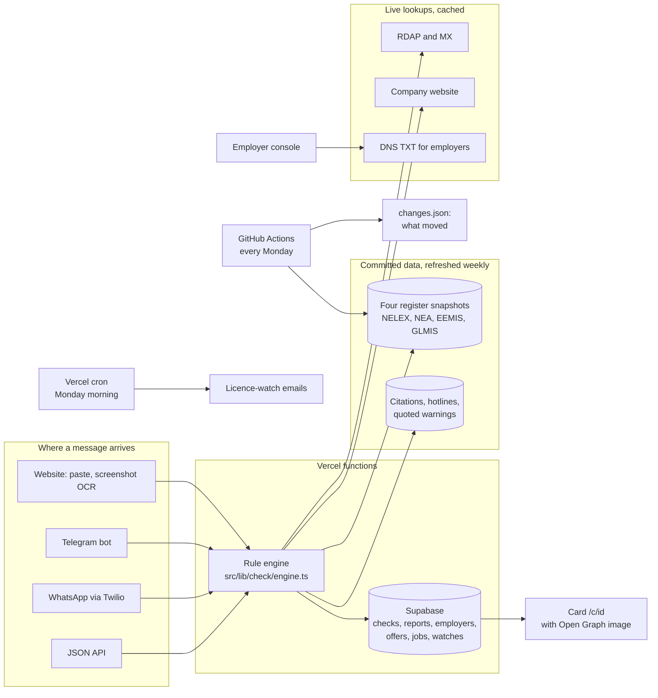
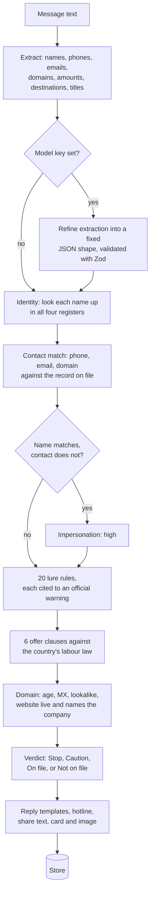

# Architecture

Daju is a Next.js 16 application with a plain-TypeScript rule engine, dated register snapshots committed to the repository, an optional Postgres store, and an optional language model. Nothing on the verdict path depends on a network call.

## The system

## One check, step by step

The verdict never comes from a model. The model, when configured, only tidies extraction and translates replies.

## Modules

| Path | Role |
|---|---|
| `src/lib/extract/heuristics.ts` | Pattern extraction: contacts, money, destinations, titles, 20 signals |
| `src/lib/extract/llm.ts` | Optional refinement and translation via Claude or Groq |
| `src/lib/registry/load.ts` | Loads the four snapshots, builds name, phone, email and domain indexes |
| `src/lib/registry/match.ts` | Name normalisation, similarity, phone normalisation |
| `src/lib/rules/lure.ts` | Lure rules with source ids into `data/law/lure_sources.json` |
| `src/lib/rules/clauses.ts` | Clause detection with citations from `data/law/clauses.json` |
| `src/lib/intel/domain.ts` | Live domain checks with a six-hour cache |
| `src/lib/check/engine.ts` | Orchestrates a check and computes the verdict |
| `src/lib/check/replies.ts` | Reply templates by scenario, English and Pidgin |
| `src/lib/store/index.ts` | Store interface, memory and Supabase drivers |
| `src/app/api/*` | Route handlers: check, registry, report, employers, offers, jobs, watch, radar, telegram, whatsapp |
| `src/lib/telegram/*` | Telegram API client, HTML cards and keyboards |
| `src/lib/radar.ts` | Live counts for the Radar page |
| `scripts/registries/diff.mjs` | Compares a fresh snapshot with the committed one and records what moved |
| `scripts/registries/*` | Scrapers that produce the snapshots |
| `data/registries/*.json` | The snapshots, with `as_of`, source URL and method |
| `data/law/*.json` | Verified citations, hotlines, quoted warnings |

## Registers

Each country's register is scraped by a script into one JSON file with a common schema (name, normalised name, status, licence number, emails, phones, domains, validity dates). The file records its source URL, the method used and the date. A check reads the bundled snapshot only. This keeps a check fast, keeps the demo independent of government portals, and makes every card reproducible: the snapshot date is printed on it.

Refresh: a GitHub Actions workflow runs `pnpm registries` every Monday, then `scripts/registries/diff.mjs` records additions, removals, status and contact changes in `data/registries/changes.json`, and commits both. A failed scrape keeps the previous snapshot and records the error. A Vercel cron then calls `/api/watch/notify` to email anyone watching an entry that changed.

## Storage

Six tables (`supabase/schema.sql`): checks, reports, employers, offers, jobs, watches. The Supabase driver is used when `SUPABASE_URL` and a key exist; otherwise an in-memory store, which is enough for local development. Tables can be created from inside the deployment with `POST /api/db/init` and a bearer token, because Supabase's direct database host is IPv6-only and unreachable from most laptops.

## Employer verification

An employer registers a company domain and receives a TXT record (`_daju.<domain>`, value `daju-verify=<token>`). Verification resolves that record from the server. Verified employers issue offer links (`/o/<token>`); a check that sees such a link, or an email on a verified domain, marks the sender as verified with the date and method.

## Model use

The model is optional and does two side jobs: refine extraction into a fixed JSON shape (validated with Zod) and translate the reply. Providers: Anthropic (`claude-opus-5`) or any OpenAI-compatible endpoint, Groq by default (`openai/gpt-oss-120b`). No prompt ever asks a model whether something is a scam, and no model output is shown as law.

## Deployment

Vercel, from the `main` branch. Environment: `NEXT_PUBLIC_SITE_URL`, Supabase variables from the Vercel integration, optional model keys, `DB_INIT_TOKEN`, `CRON_SECRET`, `RESEND_API_KEY`, `TELEGRAM_BOT_TOKEN`, `TELEGRAM_WEBHOOK_SECRET`, `TWILIO_AUTH_TOKEN`. `pg` is kept external at runtime (`serverExternalPackages`).

## Testing

`scripts/smoke-check.mts` runs extraction, lure rules and the clause audit on fixed inputs and fails if the expected findings are missing. `scripts/shots.mjs` screenshots every route in both themes at desktop and phone width and reports horizontal overflow.
